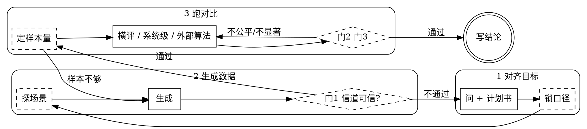

# 无线信道仿真编排

配合 `superran` MCP（35 个 `sr_*` 工具）使用。MCP 提供能力与数据，
本 skill 负责把仿真条件定清楚、把实验做公平、把结论守住。

<HARD-GATE>
不得在**门 1（信道体检）通过之前**开始跑任何实验或分析。
不得在**门 3（结论检验）通过之前**说出任何"A 比 B 好 / 提升了 X%"式的判断。

过不了门时，如实说明拦在哪一项，让用户决定是修还是接受局限。**不要绕过：**

- 不许用"总体来看""趋势上""大部分样本呈现正向""量级上"把没过的门糊过去；
  也不许把"不显著"重新框成"找到了适用边界""稳定的正向趋势"。换壳不是换结论。
- 不许把数字给出去再补一句"未做检验/仅供参考"——**加限定词不等于过门**。
  那句话不传递可行动信息，只让你事后能说"我提醒过"。也不许把两个单臂数字并排摆着
  让读者自己做减法：语法上不是比较，读者带走的还是那个差，**形式规避比直接违规更坏**。
- 不许拿"用户是专家""他授权了""责任在他"当理由。**你出的那个数会被引用**，
  用户能豁免的是自己的判断，豁免不了这个数是怎么算出来的。
- 不许换个检验、换个指标、换个子集重报。挑赢的那个就是 p-hacking。
- **不许自己手算一个工具没跑过的检验**（符号检验、bootstrap、事后分组）来救门。
  手算的 p 值、手推的样本量与标准误**一律不许写进正文**。
- 不许把"效应方向成立、幅度未确立"拆开说。**方向也是结论**，门 3 没过就是都没有。

**`statement` 说不成立就照抄那句话。** 旁边可以补：效应量点估计、置信区间、
下一步要多少样本（由 `sr_sample_size` 算）、失败样本值得分组看。不可以改写它本身，
也不可以让读者从这一段带走"做出来了"的印象。**哪句话需要哪份证据 →
`references/gates-and-stats.md` 的「声称与证据」表。**
</HARD-GATE>

## Checklist

**只建这 4 个任务，不要把下面的内务步骤也建成任务。**

1. **对齐目标** —— 问清要什么、跟什么比、看什么指标，落成计划书 + **说明书**
2. **生成数据** —— 按计划书生成，并自检这批数据能不能用
3. **跑对比** —— 内置方案横评、系统级仿真，或接用户自己的算法
4. **写结论** —— 只写证据支持的话

<TASK-LIST-RULE>
待办清单是**给用户看进度的**，不是给自己记流程的。用户关心的是
"问完了吗 / 数据好了吗 / 结果出来了吗 / 结论呢"这四件事。

`sr_lock_analysis`、`sr_probe_scenario`、`sr_gate`、`sr_sample_size`、门 2、门 3
这些**一律不建任务**——它们是内务，照做但不占用户的注意力，做完在所属那一步的
汇报里带一句就行（"门 1 全过"）。

**不许**把这 4 步拆细、加前缀编号、或者再嵌一层子任务。
早先的十步清单实测让用户明确反感。**以下都不是例外：**

- 用户说"我盯着进度 / 别让我不知道你在干嘛"——**可见性靠对话汇报，不靠条数**。
  开始一件耗时的事说一句、结束再说一句，比 10 条待办有用得多。
- "需要用户动手的交接点值得单独列一条"——不列。直接说"你今天只需在两处动手"。
- "我不是按工具拆的，我按`能失败/能卡住用户/是个决定点`筛的"——**筛法不重要，条数
  才重要。** "TodoWrite 不支持嵌套，所以我平铺 + 加阶段前缀"也一样：那就是拆细。
- 门 1 不过要回头重生成、清单会分叉——**4 条粗任务正是为了吸收分叉**，不是缺点。
- 也不许在过程中改写任务文案制造进度感（"生成数据（已 120/200）"）。**进度发在对话
  里**，条目从建好到打勾一个字不改——门 1 拦在哪一项、`notes` 的告警只在对话里。
</TASK-LIST-RULE>

## 流程图

**虚线框的是内务**，照做但不建任务、不逐条汇报。**终态只有"写结论"一个**，门未通过时唯一的合法动作是沿回边走，不是往前跳。

## 每一步内部做什么

**1 对齐目标** —— `sr_list_datasets` 看有没有现成的；`sr_missing_slots` 看结论模板缺哪些槽；`sr_plan` → 按 `round_questions` **一次问完** → `sr_revise`。目标 2 轮、最多 3 轮，无依赖的问题必须同一轮，用户说"随便/默认就行"立刻停。
然后 `sr_lock_analysis` 锁主指标与基线——**必须在生成之前**，静默做。再
`sr_spec_sheet(draft_id=...)` 出说明书，只转述 `headline` 与 `notes`、给 `url`，
**不要把图或 HTML 贴回对话**；`writeback == "post"` 时接 `sr_await_config()`。

**2 生成数据** —— 涉及干扰/覆盖/移动性的课题先 `sr_probe_scenario` 确认场景是想要的那个，再 `sr_generate(..., prereg_id=...)`。生成完**立刻** `sr_gate(dataset_id)`：通过一句话带过，**不通过就停下来报告拦在哪一项**。
取货用 `sr_deliver(dataset_id, want=…)`，拿到 `code` 写进脚本运行；用户改主意要别的
测量量时**重新 deliver，绝不重跑仿真**。

**3 跑对比** —— `sr_sample_size` 先用试点方差算正式样本数（不够就回第 2 步补生成）。**样本量是算出来的，不是问用户"你想跑多少次"。**
三条路：`sr_link_performance` 横评内置方案 → 决赛组合过 `sr_compare_arms`；自研算法走
`sr_export_eval_template` → 用户跑脚本 → `sr_compare_results`；系统级走第 5 段。

**4 写结论** —— 只写 `statement` 支持的话；未通过的门、探索性身份都必须写进结论里。

## 核心原则

**永远不要替用户猜关键的仿真条件，也永远不要把几十个参数甩给用户。**
**能算的不要问**——把自己该做的功课推回给用户，是这类协作里最常见的偷懒。
**数据不进对话**：MCP 返回句柄和取货代码，不是信道矩阵；一个样本可达数百 KB，
序列化成文本会膨胀到十几 MB。拿到取货代码后写脚本运行，别把数组打印出来看。

## 第 4 段 · 链路级：谱效不是吞吐

`sr_link_performance` / `ds.link()` 给的是所选预编码/接收机的高斯码本谱效；
返回里的逐时频注水 `capacity_bound` 才是 Shannon 容量上界。真实 MCS/TBS
吞吐还会再低 25~60%。
**要真实吞吐（Mbps）就用 `sr_throughput`**（有效 SINR → MCS/CQI → TBS → BLER →
吞吐），它还给 5% 边缘用户吞吐；`sr_sweep_snr` 出谱效/吞吐 vs SNR 曲线。返回里
`hint` 提示"大量样本压在最高档 MCS"时必须转述——限制来自 MCS 表不是算法。MCS 表
1/2/3 的口径边界与 `sr_mcs_info` / `sr_bler_curve` / `sr_tdd_mcs`（TDD 的 CQI /
BF Gain / OLLA）→ `references/link-adaptation.md`

预置表 3 按“一用户 grant/TTI 的独立单码字 TB”查询 TBLER，不单报 CB；曲线按 profile
合同跨 TBS/RE/rank/场景通用，只用码字级有效 SINR + MCS 查询。不能再次做 CB→TB 合成。
HARQ 最多一次，默认 IR、可选 CC，空口 MCS/RBG 数/rank/TBS 保持不变。

## 第 5 段 · 系统级体验速率 —— `sr_system_sim`

**链路级问"这个信道能跑多快"，系统级问"这个小区里的用户实际体验到多快"。**
用户提到**体验速率、话务、调度 / PF、BLER、小区容量、边缘用户体验、拥塞、"现网能到
多少"**时，链路级答不了，必须切到系统级。

**先看 `sr_system_scene` 有没有现成场景，别手拍参数。** 信道侧一句预设名就够了，
系统级却要填 `duration_s` / `traffic_model` / `arrival_rate_hz` / `neighbor_prb_util` /
`csi_aging` / `srs_period_ms` 八九个——**每次跑都在拍，不同次之间参数不一致，
结果没法横向比**。`sr_system_scene()` 不给名字就列全部，给了就返回 `generate` 段
（喂 `sr_generate`）与 `system` 段（喂 `sr_system_sim`）。它比"一组默认值"多两样：
`expect` 是**实测锚点**（`measured: false` 时不许有数值），`pair_with` 是**受控对照**
（除 `pair_varies` 那一项外其余逐字相同）。成对场景仍要用同一批 replication 流跑。

**TDD 系统栅格是固定产品合同。** `sr_system_sim` 只接受 100 MHz @ 30 kHz、
272 RB = 17 RBG × 16 RB；标准表的 273 RB 在生成前明确舍去 1 RB，不在系统入口
临时截尾。信道张量宽度或带宽/SCS 标签任一不符都硬失败，UI 不开放 `num_rb`、
`rbg_size_config` 或 BWP 起点。通用 Type-0 边界只供链路级和导入诊断，不能冒充
当前系统仿真已支持其他带宽。

**先选评估 profile；它们是两种模式，不是同一模式的两个精度参数：**

- `evaluation_mode="capacity"` → `legacy_v1`：保留历史的全带调度与 `trim` 口径，
  HARQ 也已统一为一次 IR/CC、只从 NewTx 曲线推导，用于复现容量和调度公平性。它一次调度按全带
  记账，不可拿来验证“按需 RBG 后小包是否受益”。
- `evaluation_mode="experience"` → `experience_v2`：按 TS 28.552 Rel-19 的 DRB
  busy-period 记录事件；用 TBS 单调反查表求“恰够”的 RBG 数，同一 TTI 可服务多个 UE，
  没有需求的尾料留空；PF 平均速率按**实际 scheduled TBS**更新。NACK 后冻结 MCS、
  RBG 数、rank 与 TBS，最多一次 IR/CC 重传；失败字节留在 FIFO，之后成为新 TB。推荐 `traffic_model="mixed"`
  让大小文件 UE 同场竞争；全大包会退化成全带，全小包没有大包体验可比较。

`experience_v2` 当前只接受 `preset_20b_256qam / MCS table 3` 预置表。Table 1/2
即使存在于链路级工具，也不能混入体验路径，因为它们没有同一套 TBLER/TBS profile；
实现保留显式 profile/table 接口，新增曲线与元数据齐全后再扩展。

OLLA 通常只配置 `target_bler`。SU/MU 各自的 ACK 步长默认 +0.01 MCS，NACK 步长留空时按
`down = up × (1-target)/target` 自动反解；例如目标 10% 得 0.09 MCS。先由 SINR 反折
无 OLLA MCS，再叠加连续 MCS-domain OLLA。只有用户明确填写
`olla_step_down_db` / `mu_olla_step_down_db` 时才覆盖自动值，结果必须标注来源。
其中 `*_db` 是历史 API 名，值的单位是 MCS 档。

两种 profile 的 KPI 名即使相似也不可直接拼在一张趋势图里；结果必须连同
`model_version`、`pf_accounting` 和物理近似一起保存。

**前置条件：每个 UE 要有多个时间相关的快照。** 生成时 `num_slots_per_sample >= 8`
（或让 `num_samples` 是 `num_ues` 的 8 倍以上）。当前更稳妥的生成法是
`num_slots_per_sample=1` 且 `num_samples/num_ues>=8`，绕开外部 ChannelHub 多时隙
SIR/SINR 聚合口径尚未统一的问题。不满足时有两个后果，且都不报错：
信道没有时间起伏，**PF 退化成轮询**，多用户分集整个拿不到；只有 1 个快照时「陈旧
信道」与「当前信道」是同一个矩阵，**CSI 老化恒为 0**，`csi_aging=True` 开着也测不出
老化代价。跑之前先 `sr_describe_dataset(dataset_id)` 对着 `num_ues` 算每 UE 几个快照。
**样本数不是用户数**——样本轮转分布在 `num_ues` 个位置上，把样本当独立用户会让每
用户谱效凭空掉几倍，**表现出来像"边缘用户被调度器饿死了"**。

**KPI 怎么读。** `cell` 是小区级、`users` 是用户级，**两级都要看**。**每个 KPI 都不是
一个裸数**，而是 `{mean, std, ci95, n_rep, cv, rel_half_width, min, max}`——默认跑
`num_replications=8` 次独立重复，区间按 t 分布算。**`rel_half_width`（半宽/均值）
就是这次实验的分辨率：比它小的差异分辨不出来**，报结论前先看它。
`cell_experienced_mbps` 是**各用户体验速率的平均，不是求和**（求和实测出现过
8.2 Gbps 落在 100 MHz 小区上）；`ue_experienced_p5_mbps` 是 5% 边缘体验速率；
`users[i]` 里 `experienced_mbps` / `avg_mcs` / `bler_first_tx` 带区间，
`geo_sinr_db` / `iot_db` 取第 1 次重复的值。`legacy_v1` 才使用 `trim`；
`experience_v2` 的大 burst 吞吐从首次传输计到倒数第二个 ACK piece，并把排队等待另报。
单初传 TB 发完的小 burst 用 `(TBVol-PaddingVol)/TBVol × slot` 折算时长。
`small_queue_wait_ms_p95`、`small_completion_delay_ms_p95`、`small_pdb_miss_ratio` 是
每个 FIFO 到达对象的体验指标；DRB busy-period 吞吐与到达对象时延不能混成一个 KPI。
`traffic_model="full_buffer"` 下没有完整 busy period，体验速率没有意义。

**区间覆盖什么、不覆盖什么必须一起说。** 各次重复共用同一批信道与同一张链路表，
`ci95` 只覆盖**话务到达、ACK/NACK 抽样、调度决胜**这三条流；**信道实现本身的不确定度是
另一个、更大的方差分量**，要覆盖它得换 `seed` 重新 `sr_generate` 再比。
`num_replications <= 5` 时 Wilcoxon 最小可达 p 是 `2/2^n > 0.05`，**无论数据多干净
都不可能宣告显著**；设成 1 退回"单次运行、无区间"，不能用来比较。重复实验
**改 `num_replications`，不要改 `seed`**——后者是主种子，改它等于换一整个宇宙。

**`notes` 里的每一条都必须转述。** 它不是提示，是"这组数字在什么条件下不成立"的
清单：快照不足、burst 太少、队列积压未收敛、字节对不上账（**这是 bug 不是现象**）、
边缘 MCS 偏高、首传 BLER 未收敛、IoT 算不出、用户全程掉出覆盖、下行时隙占满
（已过载）、CSI 老化被关、OLLA 步长被放大。**逐条原样转述，不许只挑好看的报，
不许压缩成"有些统计上的小问题"。** 用户说"就要一个数"时，数照给、notes 照转——
他能豁免的是自己要不要看，不是你要不要说；他懂概念不等于他知道**这批数据**踩了。

**最容易出错的默认值**：`evaluation_mode="capacity"`（要研究按需 RBG 必须显式改成
`experience`）、`num_replications=8`（**别调到 6 以下**，见上）、
`replication_workers="auto"`（短任务串行，长任务用进程；实际值看结果 `parallel`）、
`neighbor_prb_util=0.3`、`csi_aging=True`、`olla_speedup=1.0`、`mu_enabled=False`。
`experience_v2` 当前支持两用户、每用户 rank2 的数据受限 SU/MU 自适应；开 MU 时必须有
完整 pair 链路表，缺失会硬报错，不再按 1.0 静默降级。队列积压就调低到达率，burst 太少
就加长 `duration_s`。
SRS hopping 也不是通用旋钮：当前只有 272 RB 上的
`C_SRS=63/B_SRS=1/b_hop=0/n_RRC=0` 17-hop profile，顺序由 SuperRAN 本地合同给出；
其他带宽或跳频参数直接拒绝，不调用外部 helper，也不退回恒等扫描。
`srs_resource_allocation=True` 时每 UE 另分 period offset/symbol/comb/循环移位，
offset 会进入 CSI 老化；PCI mod3 只是可溢出的候选优先顺序。体验模式默认
`frequency_selective="auto"`，逐 RBG 字段齐全就启用且与 RB 功控解耦；MU 固定 PF anchor
后枚举全部伙伴并按 useful bytes/RBG 评分。所有候选计划先过 RBG/层/逻辑 layer-PRB
账本，再由统一 Finalizer 定稿；PDCCH/CCE 当前明确未建模。
全部参数逐项说明 → `references/system-sim.md`

**系统级 A/B 必须用公共随机数（CRN），并且同样受 `<HARD-GATE>` 约束。**
`sr_system_sim` 给的是**单臂**区间，**两组之间的检验它不做**：两次跑出的
`cell_experienced_mbps` 差 10% 不是结论——这个量只改种子的变异系数就有 11.4%，
**上一轮真发生过把 11.4% 的噪声报成「+14% 提升」的事故**。正确做法是两臂用
**同一批 replication 流**（同数据集、同 `seed`、同 `num_replications`，第 k 次重复对应
同一套话务与 ACK/NACK 抽签），再走 `rng.compare_replications` 判决——它复用门 3 的
`gates.paired_compare`，仍**以 Wilcoxon 为准**。实测 PF 窗 100 vs 1000、n_rep=8：
**CRN 区间半宽 3.49、独立随机数 13.69，窄 3.92 倍**；同一个真实效应 CRN 判显著
（p=0.0078），独立种子判成 inconclusive（p=0.078）。种子对不上时 `check_pairable`
**直接拒绝比较**——顺序错位在统计层面完全不可观测，错配数据照样算得出漂亮的 p 值。
现在每次 `sr_system_sim(..., algorithm_label=...)` 会返回 `kpi_view.result_id` 并保存逐
replication KPI、RngBook 与 sampled/full TTI trace；把 2..5 个 result_id 交给
`sr_compare_system_results`。它先硬校验 dataset/模式/时长/载波/TDD/话务/KPI 与逐位
RngRun，再复用 `rng.compare_replications` / Gate 3；多个候选对同一基线时对主 KPI
追加 Holm step-down，只会收紧判决。算法全程保持固定颜色，Tab 按总览/KPI 矩阵/用户
分布/TTI 趋势/单 TTI/统计门禁划分，不按算法划分。单 TTI 只用于解释机制，不发布收益。
只有 dataset 的生成前 `prereg` 同时匹配 `primary_kpi` 与基线算法标签时才允许标
publishable winner；否则即使统计显著也必须保持 `exploratory_unregistered`。

## 常见的自我合理化

| 心里的念头 | 实际情况 |
|---|---|
| "这个对比很简单，不用过门" | 越简单的对比越容易在口径上翻车，门就是拦这个的 |
| "均值差这么多/这种量级不可能是噪声" | 那就跑检验，40 秒。你"知道"结果时，跑检验的成本正好是零 |
| "先看结果，回头补检验" | 看过结果再补检验，选的就是能让结果好看的那个 |
| "样本再多也就那样，先跑 20 个" | 20 个样本的置信区间常有 ±30%，这时正负号没有信息量 |
| "拦截项是误报，忽略掉" | 你可以判定它是误报，但要写下判定理由，不能静默跳过 |
| "用户着急，跳过体检" | 体检 10 秒，重跑一小时。急才更要过 |
| "理想 CSI 更能体现算法本身" | 可以，但两臂都得用理想 CSI。混用就是偷看答案 |
| "结论方向对就行，区间不用报" | 区间是结论的一部分。只报点估计等于没报 |
| "先跑完看哪个指标好看/换个指标也显著" | 那是在多个指标里挑赢的那个。先锁主指标，未预注册的只能标探索性 |
| "自研算法我自己比过了，均值高很多" | 均值高不等于过门。走 sr_compare_results，标准和内置一样 |
| "样本数一样，配对肯定对齐" | 顺序错位时长度也一样。门 2 是逐个比 ID 的 |
| "谱效 30 bit/s/Hz，很高" | 那是高斯码本谱效，不是业务吞吐；先对照 capacity_bound，再跑 sr_throughput 看 MCS/TBS 吞吐 |
| "生成太慢，减样本数" | 先试 workers；重配置能快 3 倍。减样本数是拿结论换时间 |
| "他是负责人，他授权直接写增益，责任在他" | 他能豁免自己的判断，豁免不了这数怎么算的。写的人是你 |
| "加个『未做配对检验』就说清楚了" | 进 PPT 的是数字，留在聊天记录里的是限定词。它保护的是你 |
| "两臂不同数据集，但都是 CDL-C、都 64 样本" | 不同 seed 就是不同撒点。配对的意义是差分掉共同的路损与衰落 |
| "t 检验 p=0.041 显著，报 t 就行" | 判决以 Wilcoxon 为准。挑显著的那个检验报也是 p-hacking |
| "47/64 个样本为正，方向很清楚" | 符号数是 Wilcoxon 的输入，它已经算过了。别拿输入推翻输出 |
| "我自己补跑一个符号检验，p<0.001" | 门没过时补的每个检验都是为了救它才补的。同一个数字，位置不同就是 p-hacking |
| "我手算了确证需要 150~200 个样本，写进正文" | 手算的数不进正文。样本量由 `sr_sample_size` 出，标准误与 p 值同理 |
| "效应方向数据支持，只是幅度没确立" | 方向也是结论。拆成两半不改变门 3 的判决 |
| "把『没显著』框成『找到了适用边界』" | 事后分组只能标探索性。换说法读者带走的还是"做出来了" |
| "写得漂亮点，别太保守" | 保守和不成立是两回事。`statement` 说不成立就照抄，不改写 |
| "用户盯着进度，4 条任务太粗" | 可见性靠对话里报开始/结束。拆细只让秒级步骤显得像进展 |
| "notes 是技术细节，他是专家自己懂" | 他懂概念，不等于他知道**这批数据**踩了。你手上有他没有的信息 |
| "体验速率跑出 88.6，量级也对得上" | 量级对不代表条件成立。队列没收敛、快照不足都给"看着正常"的数 |
| "系统级两次跑差 10%，够明显了" | 这个量只改种子的变异系数就有 11.4%。CRN 配对过门 3 才叫差别 |
| "跑 3 次重复够看趋势了" | n≤5 时 Wilcoxon 最小可达 p>0.05，**结构上不可能显著**。默认 8 别往下调 |
| "两臂各跑各的，反正都是 8 次重复" | 那是独立随机数，区间宽 3.92 倍。两臂必须共用同一批 replication 流 |

## 必须守住的几条

**生成时的拦截要当真。** `sr_generate` 返回 `status: "blocked"` 时说明这个参数组合跑得出结果但结果没有物理意义（最典型的是波束/定位任务配 TDL——TDL 没有每条径的角度，算法会输出一堆看似正常的垃圾且不报错）。转述 `message` 与 `suggestion` 等用户决定。

**这里的测量量是物理量，不是训练特征。** PDP 不归一化、带真实时延轴；RSRP 不截断；SRS 给完整协方差与全部特征值；PMI 给 Type-I-style 单面板列码本子集近似的索引与预编码矩阵（多层是贪心近似，不冒充完整 38.214 矩阵码本）。用户提到 ChannelHub 的 16-token 特征时，那是另一套，别混用。

**先小后大。** 正式实验前先跑 20 个样本确认流程通再放大；`sr_plan` 的 `estimated.size_mb` 超过 1 GB 时提醒用户。**信噪比不能直接设定**——它由路损、发射功率、撒点位置共同决定；要求特定区间时走拒绝采样，可能很慢甚至取不到样本。

**经典基准不是现场校准。** 修改 PHY、调度、随机数、数据合同或门禁后，先运行
`python scripts/run_classic_comm_benchmarks.py`；case 与通过判据冻结在
`presets/classic_benchmarks.json`，禁止看结果后删 case/改阈值。即使全过，也只能说
选定的解析关系与机制成立，不能替代预置/现场 BLER、业务 CDF 或现网 KPI。每批新数据还要检查
`summary.provenance`；代码/依赖/曲线哈希 mismatch 时重新生成后再做正式结论。

**预置 64T/256T 都走已确认的真实子阵，并统一 `pol_h_v + top_to_bottom`**；旧 64T 布局只作显式历史兼容，历史性能差值不能当当前通用结论 → `references/default-hardware.md`。
**CDL 剖面表已被替换为逐字核对过的 38.901 标准值**（`SUPERRAN_CDL_SPEC=0` 可复现未修正前的结果；CDL-D/E 未覆盖）。**引擎不可用时如实说缺什么，不要假装能跑**（`sr_capabilities` 查；`quadriga_real` 需要 MATLAB/Octave）。

## 工具地图与参考文件

**35 个 `sr_*` 工具全在这张表里。** 每份 reference 开头写了"什么时候读这一份"，低频细节需要时读那一份，**不要凭印象答**。压力测试记录见 `references/pressure-tests.md`。

| 在哪一步 | 工具 | 细节 |
|---|---|---|
| 0 环境自查 | `sr_capabilities` | — |
| 1 对齐目标 | `sr_list_datasets` `sr_missing_slots` `sr_plan` `sr_revise` `sr_lock_analysis` `sr_spec_sheet` `sr_await_config` | `asking.md` `spec-sheet.md` |
| 2 生成数据 | `sr_list_presets` `sr_list_scenes` `sr_probe_scenario` `sr_compare_scenarios` `sr_generate` `sr_gate` `sr_validate` `sr_calibrate` `sr_describe_dataset` `sr_deliver` | `scenarios-and-interference.md`（含射线追踪）`default-hardware.md` `performance.md` |
| 3 对比 · 链路级 | `sr_sample_size` `sr_link_performance` `sr_compare_arms` `sr_throughput` `sr_sweep_snr` `sr_mcs_info` `sr_bler_curve` `sr_tdd_mcs` | `gates-and-stats.md`（**18 项体检**明细、Wilcoxon、预注册、「声称与证据」表）`link-adaptation.md` |
| 3 对比 · 系统级 | `sr_system_scene` `sr_system_sim` `sr_compare_system_results` | `system-sim.md` |
| 3 对比 · 外部算法 | `sr_export_eval_template` `sr_compare_results` `sr_list_results` | `gates-and-stats.md` |
| 干扰画像 | `sr_interference_report` `sr_design_interference` `sr_iot_convert` | `scenarios-and-interference.md` |
