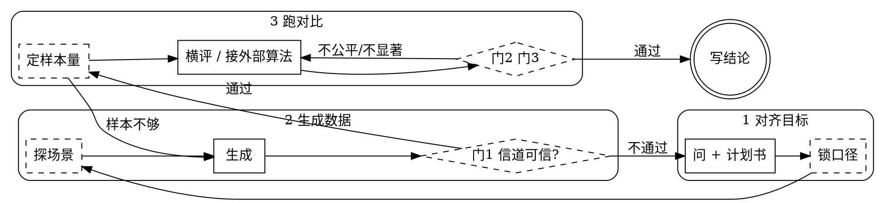

# 无线信道仿真编排

配合 `superwireless` MCP 使用。MCP 提供能力与数据，本 skill 负责把仿真条件
定清楚、把实验做公平、把结论守住。

<HARD-GATE>
不得在**门 1（信道体检）通过之前**开始跑任何实验或分析。
不得在**门 3（结论检验）通过之前**说出任何"A 比 B 好 / 提升了 X%"式的判断。
过不了门时，如实说明拦在哪一项，让用户决定是修还是接受局限——不要绕过，
不要用"总体来看""趋势上"之类的措辞把未通过的门糊过去。
</HARD-GATE>

## Checklist

**只建这 4 个任务，不要把下面的内务步骤也建成任务。**

1. **对齐目标** —— 问清要什么、跟什么比、看什么指标，落成计划书 + **说明书**
2. **生成数据** —— 按计划书生成，并自检这批数据能不能用
3. **跑对比** —— 内置方案横评，或接用户自己的算法
4. **写结论** —— 只写证据支持的话

<TASK-LIST-RULE>
待办清单是**给用户看进度的**，不是给自己记流程的。用户关心的是
"问完了吗 / 数据好了吗 / 结果出来了吗 / 结论呢"这四件事。

`sw_lock_analysis`、`sw_probe_scenario`、`sw_gate`、`sw_sample_size`、
门 2、门 3 这些**一律不建任务**——它们是内务，照做但不占用户的注意力。
做完在所属那一步的汇报里带一句就行（"门 1 十七项全过"）。

**不许**把这 4 步拆细、加前缀编号、或者再嵌一层子任务。
早先的十步清单实测让用户明确反感。
</TASK-LIST-RULE>

## 流程图



**虚线框的是内务**，照做但不建任务、不逐条汇报。
**终态只有"写结论"一个**，门未通过时唯一的合法动作是沿回边走，不是往前跳。

### 每一步内部做什么

**第 1 步 · 对齐目标**
先 `sw_list_datasets` 看本机有没有现成的（用户可能已经有数据集/脚本/上次的结论）。
`sw_plan` → 按 `round_questions` 一次性问出来 → `sw_revise`。
**目标 2 轮问完，最多 3 轮**；`remaining_all_optional` 为 true 时把下一轮
包装成一句可跳过的话，别再摆一屏选项。
定下来之后 `sw_lock_analysis` 锁主指标与基线——**必须在生成之前**，静默做。

**配置敲定后调 `sw_spec_sheet(draft_id=...)`，把说明书给用户。**
这是这一步的交付物：一份离线 HTML，画出阵列、拓扑、频域、时域、信道剖面，
外加一张逐项标注"用户指定 / 系统默认"的参数全表。
把 `headline` 和 `notes` 转述一句，**给出 `html_path` 让用户自己打开**——
不要把图或 HTML 内容贴回对话。

**第 2 步 · 生成数据**
涉及干扰/覆盖/移动性的课题，先 `sw_probe_scenario` 花几十秒确认场景是想要的
那个（11.5 倍速，几何量与全量逐位相同）。然后 `sw_generate(..., prereg_id=...)`。
生成完**立刻** `sw_gate(dataset_id)`，通过就一句话带过，
**不通过就停下来报告拦在哪一项**，不许往下走。

**第 3 步 · 跑对比**
`sw_sample_size` 先用试点方差算正式样本数（不够就回第 2 步补生成）。
内置方案见下"评价链路"；自研算法走 `sw_export_eval_template` →
用户跑脚本 → `sw_compare_results`。
**要真实吞吐（Mbps）而非香农谱效时用 `sw_throughput`。**

**第 4 步 · 写结论**
只写 `statement` 支持的话；未通过的门、探索性身份都必须写进结论里。

## 核心原则

**永远不要替用户猜关键的仿真条件，也永远不要把几十个参数甩给用户。**

**数据不进对话。** MCP 返回句柄和取货代码，不是信道矩阵。一个样本可达数百 KB，
序列化成文本会膨胀到十几 MB。拿到取货代码后写脚本运行，不要把数组打印出来看。

**能算的不要问。** 样本数是算出来的（`sw_sample_size`），不是问用户"你想跑多少次"。
把自己该做的功课推回给用户，是这类协作里最常见的偷懒。

## 第一段 · 问清楚

### 该问什么：看结论模板还缺什么

一次蒙特卡洛仿真的产出，说到底就是一句话：

> 在【场景】下，【方法】相对【基线】在【指标】上【效应 ± 置信区间】（n 样本），
> 该结论在【扫描维度】上成立。

每个方括号是一个必须填的槽。**空着的槽就是该问的问题。** `sw_missing_slots`
按"空着的代价"从大到小返回，每个槽自带 3~4 个选项。

`sw_plan` / `sw_revise` 把该问的打包成一轮，两者取其一即可——
不确定用哪个时用 `sw_plan`，它还会给出扫描建议和陷阱提示。

### 怎么问

**目标 2 轮问完，最多 3 轮。** 轮次比单轮长度更让人烦：6 个带选项的问题
一次看完，比分三轮各 2~4 个来回三次要轻松得多。

**没有先后依赖的问题必须放在同一轮。** "跟 Type I 码本比"和"用 CDL-C 还是
CDL-A"互不影响，拆成两轮纯粹是分类整齐，对用户是白白多一次来回。
`round_questions` 已经把设计层和参数层合并好了，**照着这一个列表一次问完**，
不要自己再拆。

真正有依赖的只有一处：样本数依赖试点方差，所以它压根不问用户，
由 `sw_sample_size` 算。

`remaining_all_optional` 为 true 时，第 2 轮包装成一句可跳过的话——
"剩下这些都有合理默认值，要不要直接跑？"——**不要再摆一屏选项**。

每个问题：

1. **把选项编号列出来**，带上每个选项的 `note`——什么情况下选它、有什么代价
2. **推荐项放第一位**并说一句为什么。给一排平铺的选项让用户自己权衡是偷懒，
   明确推荐才是帮忙
3. **最后留一句"或者你直接说"**——选项是启发思路，不是限制

> **你的方法要跟什么比？**
> ① 3GPP Type I 或 Type II 码本 —— 最常见的基线，几乎所有 CSI 工作都会比它 **← 推荐**
> ② 理想信道的 SVD 预编码 —— 理论天花板，看你离上界差多少
> ③ 某篇已发表方法 —— 告诉我哪篇，我尽量对齐它的实验设置
> ④ 还没定，先看可行性
>
> 或者你直接说。

开放式问"你要跟什么比"，很多人第一反应答不上来；但看到"理想信道的 SVD 上界"
就会想起来还有这条路。

### 什么时候停

- `has_more_rounds: false` → 问完了
- **用户说"随便 / 默认就行 / 就这样"** → 立刻停，别再问下一轮

每一轮之后都能直接生成，没答的走默认值，`auto_decided` 会如实列出替用户做的决定。

### 每轮还要带上

- **`suggested_sweeps` 提一句** —— 很多结论必须靠 A/B 才立得住，一次生成两组
  比事后补跑省事
- **`pitfalls` 挑相关的说一两条**，别全倒出来
- **`also_configurable` 只报名字**，让用户知道边界在哪，别展开成问题

### 默认信道配置：真实 AAU + n41

**不确定用什么配置时，用 `company_64t4r`（单小区）或
`company_64t4r_multicell`（多小区）。** `sw_plan` 已经默认挑它们。

| | 默认值 |
|---|---|
| 阵列 | 64T = **8H x 4V x 2pol** RF 端口 |
| 馈电 | **1 驱 3** —— 每端口驱动垂直相邻 3 个阵子，共 **192 个物理阵子** |
| 间距 | 水平 **0.5λ**、垂直 **0.67λ**（RF 端口垂直相位中心 2.01λ，有栅瓣） |
| 载波 | n41 **2.6 GHz**、**30 kHz** 子载波间隔、**100 MHz** |
| RB | **272**（17 RBG x 16 RB）。仿真到 RB 为止，不建模到 RE |
| 终端 | **4R** 接收、**下行** |

**这不是可选项，是本地硬件事实。** ChannelHub 的默认 `legacy_64` 把 64 个端口
当成 64 个独立阵元、间距一律 0.5λ——那是另一套阵列。面板是 8x4x2 时
superwireless 会自动切到真实模型，`summary.antenna_model` 里能查。

实测两者的差距（同 seed、单小区、30 样本）：

| | 真实 AAU | legacy_64 |
|---|---|---|
| SVD 谱效 | 28.20 | 33.23 |
| 吞吐均值 | 1055.5 Mbps | 1337.5 Mbps |
| 边缘用户 | 582.4 Mbps | 940.0 Mbps |

**legacy 把吞吐高估 27%、边缘用户高估 61%。** 独立阵元有更多空间自由度，
而真实端口是固定 3 阵子子阵、垂直分辨力低得多。

两条边界要记住：

- **几何 SINR / IoT 不受阵列模型影响。** ChannelHub 的几何 SINR 走另一套
  简化模型（水平 0.5λ、垂直平坦），阵列模型只改信道矩阵——所以它影响
  预编码/谱效/吞吐/CSI，不影响干扰画像。
- **阵元方向图是 3GPP 式参数化模型，不是实测方向图**
  （`element_pattern_is_measured: false`），别说成实测。

272 vs 273：38.104 标准表在 100 MHz/30 kHz 下是 273 RB，272 是按 RBG 对齐
（17x16）取的。两个数口径不同，默认用 272。

### 仿真说明书：把配置画出来给用户看

用户看不懂一串 `key: value`。"64T"要在脑子里还原成 8x4x2 的双极化面板、
"7 站 3 扇区 ISD 500"要还原成六边形栅格上 21 个扇区的指向、"272 RB"要还原成
17 个 RBG——**这一步在脑子里做，就一定有人做错。**

`sw_spec_sheet(draft_id=... | dataset_id=... | preset=...)` 出一份离线 HTML。
**信息是分级的**：首屏只有网络拓扑图 + 关键信息卡，其余折进页签。

首屏 —— 打开就看见，不用点：

- **网络拓扑图**：基站、用户撒点、扇区指向，图内直接标站数/小区数/UE 数/站间距 + 比例尺
- **关键信息卡**：规模、阵列、频点带宽、RB、场景——做仿真通常最关心的那几个

页签 —— 按需点开：

| 页签 | 回答什么 |
|---|---|
| 基站阵列 | 端口怎么排、每端口驱动几个阵子、间距多少、有没有栅瓣 |
| 频域与时域 | 多少 RB、怎么分 RBG、占多宽、TDD 怎么配 |
| 信道剖面 | 多径的时延与功率分布 |
| 参数全表 | 逐项标注**是用户指定的还是系统默认补的** |

**把这次对话里用户专门提过的参数名传进 `highlight`**（如
`highlight=["isd_m", "num_interfering_ues"]`），它们会被顶到首屏最前面并高亮。
用户点名过什么就传什么——首屏因此既覆盖"通常最关心的"，也覆盖"这次特别在意的"。

### 用户可以在说明书里直接改参数

「改配置」页签是个**可交互的调参面板**：改站点数/站间距/扇区数，
拓扑图**实时重画**；改完点「复制配置改动」，把内容粘回对话框。

粘回来的东西长这样，**照着做就行**：

```
【仿真配置调整】基于 多小区 · 可调参
改动 2 项：
  num_sites: 7 -> 19
  isd_m: 500 -> 300

overrides = {"num_sites":19,"isd_m":300}

请用这个 overrides 重新配置并重跑（sw_revise / sw_generate），完事再出一份说明书。
```

**只带改动过的项**，没动的不进 payload——所以直接把 `overrides` 传给
`sw_revise` / `sw_generate` 即可，不会把默认值当成用户意图固化下来。

拓扑预览的坐标是**生成时由 ChannelHub 现算后内嵌**的（ISD=1 的单位布局），
前端只做线性缩放，不在 JS 里重写栅格逻辑——预览和真跑的几何一致。

**画的是将要跑的那个仿真，不是配置意图。** 站数被六边形栅格吸附（配 2 站实际
7 站）、阵列走了 legacy 而非本地 1 驱 3 硬件——这些差异都按实际画，
并写进 `notes`。用户看到"这 17 项是我没管、系统替我定的"才有机会喊停。

`sw_generate` 会自动再出一份（带真实撒点），句柄在 `summary.spec_sheet`。

**只转述 `headline` 和 `notes`，给出 `html_path`。** 不要把图或 HTML 贴回对话。

### 场景是不是想要的那个 —— 先探测，再下单

**用户说"高干扰场景"时，"高"是个数，不是形容词。** 别照着预设名字就开跑，
先花几十秒确认。

- `sw_list_presets(group=...)` 按组看 **23 个场景**：干扰场景 / 测量干扰 /
  大站间距 / 移动性 / 高铁 / 传播条件 / 多小区干扰 / 基线 / 射线追踪 / 室内与专网
- `sw_probe_scenario(preset=..., num_samples=30)` —— **下单前先看货**。
  把 `num_rb` 压到 24、`num_ofdm_symbols` 压到 4、关掉 SSB，几何量与全量
  **逐位相同**（实测），**11.5 倍速**（2602 → 226 毫秒/样本）。
  回干扰画像、链路预算、路损/距离/视距/多普勒分布
- `sw_compare_scenarios([...])` —— 几个候选并排比一张表

探测**给不了**谱效、吞吐、时延扩展估计、宽带预编码——这些必须跑正式生成，
返回里的 `not_available` 会列清楚。

### 干扰强度用 IoT 说话

**业务域和测量域是两回事，混起来的结论一定是错的：**

| | 是什么 | 决定什么 | 怎么看 |
|---|---|---|---|
| 业务域 | PDSCH/PUSCH 受到的干扰 | 吞吐、MCS 选择 | IoT `(I+N)/N`，>= 20 dB 算高干扰 |
| 测量域 | SRS / CSI-RS 导频受到的干扰 | 信道估计精度、预编码好不好 | 导频域 SIR、估计 NMSE 下限 |

实网里最难查的一类问题正是"业务域 SINR 看着还行、测量域已经崩了"——
预编码用的是被污染的信道估计。测量域的量**只在 `link="BOTH"` 时才产生**。

- `sw_interference_report(dataset_id)` —— 两个域一起给，含等效小区负载
- `sw_design_interference(target_iot_db=20)` —— 要造某个干扰强度该动哪些旋钮
- `sw_iot_convert(...)` —— IoT / 等效负载 / 分级之间换算

**绝对不要用 `snr_dB - sinr_dB` 当 IoT。** 这两个字段口径不同（前者不含阵列
增益、还多减了 `10log10(RB)`），相减差几十 dB，看着像 IoT 而已。
正确算法是 `IoT = SIR/(SIR-SINR)`（线性域），`sw_interference_report` 已经这么算。

**声称"高干扰"之前必须复核**：`sw_gate` 里的 IoT 自洽性检查会给出实测中位数与
等级。预设里的 `label` 写的是设计意图，不是保证达标的实测值。

## 第二段 · 生成与取货

`sw_generate` 返回 `plan_markdown`（上半人话、下半配置，已随数据存档）。
用户想先看再跑时展示出来；着急时存档即可。

取货用 `sw_deliver(dataset_id, want=<用户的话>)`，`want` 直接写自然语言。
拿到 `code` 后**写进脚本文件运行**，不要逐行复述。

用户中途改主意要别的测量量时，**重新 deliver，绝对不要重跑仿真**——
所有测量量都是从信道现算的，重新取货是秒级的。

## 第三段 · 三道门

### 门 1 · 信道可信 —— `sw_gate(dataset_id)`

18 项检查，分四类：对 3GPP 标准（路损逐点比对、CDL 剖面逐簇比对、角度扩展）、
对物理定律（时频能量守恒、谱效不超容量上界、SISO 退化到香农）、对配置
（场景与剖面视距类别是否矛盾、小区数是否被栅格吸附、**干扰是否真的进了 SINR**）、
对统计（收敛、信噪比覆盖）。

最常触发的三条，都值得原样转述给用户：

- **场景与剖面视距类别不匹配** —— 视距场景配非视距剖面，时延扩展会偏几倍
- **小区数被悄悄改掉** —— 六边形栅格站数只能是 1/7/19，配 2 站实际生成 7 站
- **干扰没进 SINR** —— 多小区配置下 SINR 若等于纯热噪声 SNR，干扰类结论全不成立

想看 3GPP 口径的校准量（耦合损耗、几何量、时延/角度扩展、PRB 奇异值三条 CDF），
用 `sw_calibrate`。它只出数不判决，数拿去对 R1-165974 / R1-165975 的参考曲线。

### 门 2 + 门 3 · `sw_compare_arms`

**两个方案必须跑在同一批信道上。** 共同的路损、撒点、衰落起伏会被差分抵消，
剩下的才是方案本身的差别；配对设计所需样本数常比非配对少一个数量级。

门 2 拦三件事：两臂不在同一数据集、配置有未声明的漂移、**CSI 口径不一致**。
最后一条是无线论文评审最常抓的——自己的方法用理想信道预编码、基线用估计信道，
测出来的"增益"里混着"提前知道答案"的部分。

门 3 拦四件事：95% 置信区间跨零、配对检验不显著、单个样本贡献过半、
声称的增益落在区间外。

**判决以 Wilcoxon 符号秩检验为准**，配对 t 检验只作参考。谱效的逐样本差值
分布常是偏的（少数用户位置贡献大部分差异），t 检验的正态假设不成立，
小样本下它偏乐观。只有 Wilcoxon 算不出来（全零差值等退化情形）才退回 t。

`paired.decision_test` 写明这次用的是哪个，`tests_agree` 为 false 时说明两个
检验结论冲突——**这时不要只报 t 的 p 值**，`statement` 会自动把冲突写出来。

返回的 `statement` 是一句可以直接写进报告的话。**过不了门时它自己会写
"结论不成立"及原因——照抄，不要改写成更好听的说法。**

### 自研算法怎么进门 —— `sw_export_eval_template` + `sw_compare_results`

**`sw_compare_arms` 只认六种内置预编码。** 用户自己的 CSI 压缩、信道估计、
波束管理、定位、调度算法进不去——而那恰恰是这个项目最核心的用途。走这条路：

1. `sw_export_eval_template(dataset_id)` → 拿到一份可直接运行的脚本
2. **写进 .py 文件，让用户替换 `my_algorithm` 的函数体**。不改也能跑
   （预填示例是估计 CSI 下的 SVD vs Type I），先确认管道通再换算法
3. 用户运行它 → 注册两个臂，打印两个 `result_id`
4. `sw_compare_results(a, b)` → 过门 2、门 3，拿 `statement`

**MCP 不执行用户代码。** 脚本在用户自己的进程里跑，只把标准化的逐样本结果
注册回来。这条边界不要试图绕过。

注册时锁死三件事，任一不成立就拦：数据集内容摘要、样本 ID **逐个按序**比对、
指标与单位。配对检验的全部有效性建立在"第 i 个数对应同一个信道实例"上，
**错配时它照样会算出一个看起来很显著的 p 值**。

两个提醒必须转述给用户：

- **两臂用同一份 `IDS`，顺序不要改**（模板里已经统一了，别让用户自己排序或筛选）
- **预编码只看 `h_est`，`h_true` 只用于评估**。外部结果是用户自己算的，
  MCP 看不到里面用了哪个——门 2 只能查 `method_metadata` 里的声明。
  所以要提醒用户在 `method_metadata` 里写 `{"csi": "estimated"}`

### 预注册：生成之前把主指标定下来 —— `sw_lock_analysis`

三道门证明不了一件事：**主指标是看数据之前定的，还是跑完之后挑出来的那个
最好看的。** 真实过程往往是——跑完发现平均谱效没提升，顺手换成 5% 边缘用户
谱效，有提升就报了这个。每一步都合理，合起来是在多个指标里挑赢的那个。

所以第 4 步在生成前调 `sw_lock_analysis`，把 `prereg_id` 传给 `sw_generate`。
之后 `sw_compare_results` 会判身份：

| 身份 | 含义 | 结论句怎么写 |
|---|---|---|
| `primary` | 与预注册主指标一致 | "结论成立（预注册主指标 pr_xxx）" |
| `secondary` | 预注册的次要指标 | 可以报，但主结论要用主指标 |
| `exploratory` | 没登记过的指标 | **"统计上成立，但这是探索性分析，不是预注册主结论"** |
| `unregistered` | 数据集没绑预注册 | "结论成立（无法证明主指标是事先定的）" |

**探索性不等于不成立**，它统计上可能很显著。区别在于**能不能当主结论**。
`statement` 会自己把身份写出来——照抄，不要删掉那半句。

用户改主意换指标时：再调一次 `sw_lock_analysis` 得到新 `prereg_id`，
旧的不动。但要说清——**拿同一批数据换指标不算独立验证**，想把新指标
当主结论得用新数据。

### 评价链路：谁出数、谁判决

- **`sw_link_performance` 出数** —— 一次调用在同一批信道上横评多个方案（默认
  svd / svd_wideband / type1 / dft，自研方案加进 `methods`），返回谱效均值、
  95% 置信区间与收敛判断。**只出数不过门**：均值差再好看，也不许直接写成结论。
  `use_estimated_csi: true` 是 CSI 反馈课题的核心对比——估计信道算预编码、
  理想信道评性能，量的是 CSI 误差的真实代价。
- **`sw_compare_arms` 判决** —— 横评筛出的决赛组合两两过它：配对检验连过
  门 2、门 3，产出可照抄的 `statement`。
- **`sw_gate` 是门 1 的唯一入口** —— 它把可信度体检翻译成门禁判决；
  `sw_validate` 是那份体检的报告形态，手动排查细节时看它，走流程一律 `sw_gate`。

### 香农谱效不是吞吐 —— `sw_throughput`

`sw_link_performance` / `ds.link()` 给的是 `SE = Σ log2(1+SINR)`，**香农上界**。
真实系统达不到它，差 25~60%，原因有三条，都是可量化的：

1. **调制受限** —— 20 dB 时香农说 6.66 bit/s/Hz，64QAM 最多给 5.80
2. **码率离散** —— MCS 只有 29 档，实际码率总落在需要的码率之下
3. **有限码长 + 实现损失** —— LDPC 距容量 1~2 dB，码块越多 TB 越易错

`sw_throughput` 走业界做系统级仿真的标准路径（链路到系统映射：
有效 SINR → MCS/CQI → TBS → BLER → 吞吐），给出 **Mbps** 和
**5% 边缘用户吞吐**（3GPP 评估里的公平性指标，比均值更能说明问题）。

**返回里 `hint` 提示"大量样本压在最高档 MCS"时，一定转述给用户**——
那说明限制来自 MCS 表而不是信道或算法，换 `mcs_table=2`（含 256QAM）
通常直接提升 20% 以上。实测 29 dB 的场景：表 1 均值 1373 Mbps，表 2 1690 Mbps。

`sw_sweep_snr` 出**谱效/吞吐 vs SNR 曲线**，无线论文里最标准的那张图。
各点跑在同一批信道上、彼此配对，曲线不含信道抽样噪声。
达成率的走势最有信息量：低信噪比处 70~77%（受噪声限），
高信噪比处掉到 40% 以下（受 MCS 表封顶限）。

**一条必须守住的边界**：表 1/2 的 MCS/CQI/TBS 按 38.214 精确算，QAM 约束
容量精确求积，但 BLER 是有限码长分析模型。表 3 则是用户提供的 28 档 MCS +
56 条 NewTx/ReTx 解调曲线（1824 点），不是 3GPP 标准曲线。数据所有者已确认：
源标签 Es/No 就是经典 MMSE 接收机的 SINR；其他链路维度暂不参数化。

- `sw_mcs_info(table=1/2, show_bler_anchors=true)` —— 看分析模型门限
- `sw_mcs_info(table=3, show_bler_anchors=true)` —— 看用户曲线两套门限与哈希自检
- `sw_bler_curve(mcs=..., tx_mode="newtx"/"retx")` —— 取单档原始曲线或插值
- `sw_tdd_mcs(dataset_id=..., cqi=..., olla_mcs_offset=...)` —— TDD 最终 MCS 与逐流审计链

表 3 的 HARQ 首传用 NewTx、后续用 ReTx；只有一条 ReTx 曲线，因此多次重传会
复用它并显式标成假设。不要额外推断 TB/CB、块长、信道、层数或译码器的影响。

### TDD 的 CQI、BF Gain 与 OLLA

用户要求 TDD MCS 或提到 CQI/BF Gain/OLLA 时，调用 `sw_tdd_mcs`，不要在对话里
手算。固定顺序是：`CQI → 按谱效映射初始 MCS → 该 MCS 的 NewTx 目标 BLER
SINR 门限 → + BF Gain → 重映射 MCS → + OLLA → floor → 钳位 0..27`。

- CQI 是 PMI 权测得的 pre-BF 索引；CQI0 不调度，不能当 MCS0
- BF Gain 逐 RB、逐流计算 `post-MMSE SINR_SVD - post-MMSE SINR_PMI`
- 两条链路必须共用信道、CSI、rank、功率、噪声、干扰和经典 MMSE 接收机，
  只改变预编码权；rank 不同不是 BF Gain
- 用户 SINR 对全部 RB×流在 **dB 域做算术平均**，不做线性域平均或 MIESM
- OLLA 单位是连续 MCS 档位，正值更激进；先相加再严格向下取整
- 默认目标首传 BLER 10%，ACK +0.1、NACK -0.9；反馈只更新下一调度时刻

转述结果时至少给出初始 MCS/门限、逐流 BF Gain、用户 SINR、BF 后 MCS、
OLLA offset 和最终 MCS；若 `clamped_low` / `mcs_clipped` 为真也必须说明。

### 跑得慢就开并行

`sw_generate` 的 `workers` 默认 `"auto"`，按配置预估耗时自动决定。
实测单样本耗时差 85 倍：单小区 32T/20MHz 是 24 毫秒，
21 小区 64T/100MHz 是 2054 毫秒——后者 200 个样本串行要 7 分钟。

- **多小区大带宽**：自动起多进程，实测 200 样本 842s → 246s
- **轻配置**：自动走串行，起进程的开销（每个子进程要重新 import
  numpy/scipy/ChannelHub 约 4 秒）反而更慢

**并行结果与串行不是同一批样本**：各块用不同 seed，统计等价、各自可复现，
但逐样本不同。摘要的 `parallel` 块会写明。**做配对比较时两臂必须用同一个
数据集**，这一点不受影响——配对比的是同一批信道上的两个方案。

还有两个提速手段，都会真实改变产出，所以必须自己判断能不能用：

- `sw_generate(collect_ssb=false)` —— 多小区场景省约 30%（交错重测中位数
  3456 → 2475 毫秒/样本，基准自身轮间波动 11.9%，所以这个差是真的）。
  代价是 `Dataset.ssb` 为空。小区选择、切换、波束管理类课题**不能**关。
- `sw_probe_scenario` —— 只看场景特征时用，11.5 倍速。但它给不了谱效与吞吐。

**不要靠"看着变快了"下结论。** 这台机器上单次计时的轮间波动就有 12%，
低于这个量级的"优化"是噪声。要比就交错重测取中位数。

### 样本量：算，不要猜

```
N ≥ ( (1.96 + 0.84) · σ_d / Δ )^2
```

σ_d 是**逐样本差值**的标准差，Δ 是想检出的最小效应。流程：先跑 20 个样本试点，
从 `sw_compare_arms` 的 `paired.std_diff` 拿 σ_d，喂给 `sw_sample_size` 算正式样本数。

反过来更该先看一眼：给定样本数，`sw_sample_size` 会算出**最小可检出效应**。
它比用户期望的增益还大时，**这次实验无论跑出什么结果都不足以下结论**——
该加样本，不是跑完再解释。

## 声称与证据

**没跑过的命令，不能说它的结果。**

| 你想说的话 | 必须已经拿到 | 不够格的替代 |
|---|---|---|
| 信道可信 | `sw_gate` 返回 `passed: true` | 上次跑过、参数看着对 |
| A 比 B 好 | `sw_compare_arms` 的门 3 通过 | 均值更大、图看着分开 |
| 提升 X% | `paired.ci95` 且区间不跨零 | 点估计 |
| 已经收敛 | `converged: true` | 样本数看着不少 |
| 干扰已建模 | 门 1 的"干扰是否进入 SINR"通过 | 配了多小区 |
| 用的是标准 CDL 剖面 | 门 1 的"CDL 剖面对标 38.901"通过 | 配置里写了 CDL-C |
| 自研算法比基线好 | `sw_compare_results` 门 2+门 3 通过 | 自己脚本里 print 的均值 |
| 这是预注册主结论 | `identity.status == "primary"` | 口头说"我本来就打算看这个" |
| 两臂配对有效 | 门 2 的"两臂可配对"通过 | 样本数一样 |
| 吞吐 X Mbps | `sw_throughput` 的返回 | 香农谱效 × 带宽 |
| BLER 是 X% | 表 1/2 只能称分析模型；表 3 只能称用户曲线插值 | 不许说成 3GPP 实测 |
| 边缘用户吞吐 | `cell_edge_mbps_5pct` | 最差那个样本 |

## 常见的自我合理化

| 心里的念头 | 实际情况 |
|---|---|
| "这个对比很简单，不用过门" | 越简单的对比越容易在口径上翻车，门就是拦这个的 |
| "均值差这么多，肯定显著" | 差 3 倍也可能不显著——方差大的时候。跑检验，别目测 |
| "先看结果，回头补检验" | 看过结果再补检验，选的就是能让结果好看的那个 |
| "样本再多也就那样，先跑 20 个" | 20 个样本的置信区间常有 ±30%，这时的正负号没有信息量 |
| "拦截项是误报，忽略掉" | 你可以判定它是误报，但要写下判定理由，不能静默跳过 |
| "用户着急，跳过体检" | 体检 10 秒，重跑一小时。急才更要过 |
| "理想 CSI 更能体现算法本身" | 可以，但两臂都得用理想 CSI。混用就是偷看答案 |
| "结论方向对就行，区间不用报" | 区间是结论的一部分。只报点估计等于没报 |
| "先跑完看看哪个指标好看" | 那就是在多个指标里挑赢的那个。先锁主指标再跑 |
| "换个指标也统计显著，就报这个" | 显著≠可当主结论。未预注册的指标只能标探索性 |
| "自研算法我自己比过了，均值高很多" | 均值高不等于过门。走 sw_compare_results，标准和内置方案一样 |
| "样本数一样，配对肯定对齐" | 顺序错位时长度也一样。门 2 是逐个比 ID 的 |
| "谱效 30 bit/s/Hz，很高" | 那是香农上界。真实吞吐要打 4~6 折，跑 sw_throughput |
| "达成率只有 40%，算法不行" | 先看 MCS 分布：压在最高档就是表封顶，跟算法无关 |
| "表 3 算出 0.1%，所以所有配置都可靠" | 曲线代表经典 MMSE 接收机的 SINR→BLER 映射，其他维度当前不建模 |
| "生成太慢，减样本数" | 先试 workers；重配置能快 3 倍以上。减样本数是拿结论换时间 |

## 必须守住的几条

**生成时的拦截要当真。** `sw_generate` 返回 `status: "blocked"` 时，说明这个
参数组合跑得出结果但结果没有物理意义（最典型的是波束/定位任务配 TDL 模型——
TDL 没有每条径的角度，算法会输出一堆看似正常的垃圾且不报错）。
转述 `message` 和 `suggestion`，等用户决定，不要自作主张绕过。

**这里的测量量是物理量，不是训练特征。** PDP 不归一化、带真实时延轴；
RSRP 不做区间截断；SRS 给完整协方差和全部特征值；PMI 给 38.214 Type I
码本索引和预编码矩阵。用户提到 ChannelHub 的 16-token 特征时，那是另一套
（为 MAE 训练服务、经过门控与归一化），别混用。

**先小后大。** 正式实验前先跑 20 个样本确认流程通，再放大。`sw_plan` 的
`estimated.size_mb` 给体积预估，超过 1 GB 时提醒用户。

**信噪比不能直接设定。** 它由路损、发射功率、撒点位置共同决定。要求特定区间时
走拒绝采样，可能很慢甚至取不到样本。想整体抬高或压低，调发射功率或站间距更有效。

**CDL 剖面表已被替换为标准值。** superwireless 启动时会把逐字核对过的
38.901 Table 7.7.1-1/-2/-3 灌进仿真器（ChannelHub 自带的那三张表角度列
与标准不符）。设 `SUPERWIRELESS_CDL_SPEC=0` 可复现未修正前的结果。
CDL-D/E 不在覆盖范围内。

## 射线追踪

`sw_list_scenes` 查场景。内置 4 个（慕尼黑、巴黎凯旋门、佛罗伦萨、旧金山）
开箱即用；中国城市 6 个（北京中关村、上海陆家嘴、深圳福田、广州天河、
杭州钱江、重庆解放碑）首次使用自动准备资产。

切场景在 overrides 里写 `{"scene": "shenzhen_futian"}`，或用
`rt_munich` / `rt_shanghai_lujiazui` / `rt_shenzhen_futian` 预设。

**比统计信道慢一个量级**（约 2~6 秒/样本 vs 0.2 秒）。要几百个样本时先提醒耗时。

**射线追踪数据集不能调 `ds.paths()`** —— 多径来自真实建筑几何，套用 CDL
标准剖面得到的角度与数据无关，MCP 会直接报错而不是返回错误结果。

典型用法是**先用统计信道快速迭代，定型后换真实地图复核**——两者取货代码一样，
算法代码一行不用改。

## 环境

引擎可用性调 `sw_capabilities`。`quadriga_real` 需要 MATLAB/Octave。
引擎不可用时如实告诉用户缺什么，不要假装能跑。

## 对话示例

> **用户**：我想验证一个改进的宽带预编码思路，跑蒙特卡洛看谱效有没有提升。
>
> **你**：（`sw_missing_slots` → 结论模板缺 4 个槽）先对齐三件事，这比参数重要。
>
> **① 跟什么比？** ① 逐 RB SVD 上界 **← 推荐** ② Type I 码本 ③ 现网 DFT 波束 ④ 还没定
>
> **② 预期增益多大？低于多少就不值得做？** ① +10% 以上 **← 推荐** ② +3~10%
> ③ +1~3%（要几百到上千样本）④ 不知道，先探路
>
> **③ 预编码用理想还是估计信道？** ① 理想 h_true **← 推荐**（先看想法成不成立）
> ② 估计 h_est ③ 两个都跑
>
> 或者你直接说。
>
> **用户**：跟 SVD 上界比，预期 3~10%，先用理想信道。
>
> **你**：（`sw_revise` → 第 2 轮参数 → `sw_generate` 20 个试点 → `sw_gate`）
> 试点跑完，门 1 通过。σ_d = 2.14，要检出 5% 增益（约 1.5 bit/s/Hz）需要 **64 个样本**。
> 现在只有 20 个，最小可检出 2.7 bit/s/Hz——比你的预期还大，这 20 个样本
> 得不出结论。补到 64 个继续？
>
> **用户**：补。
>
> **你**：（`sw_generate` 64 → `sw_gate` → `sw_compare_arms`）
> 门 1、门 2、门 3 全过。你的方案 28.41 vs SVD 上界 30.53 bit/s/Hz，
> 差值 -2.12（-6.9%），95% CI [-2.71, -1.53]，n=64，p=1.2e-9。
> 达到上界的 93%——**没有超过上界，这符合预期**（SVD 是理论最优）。
> 如果目标是逼近上界，93% 是个可以写的数。
